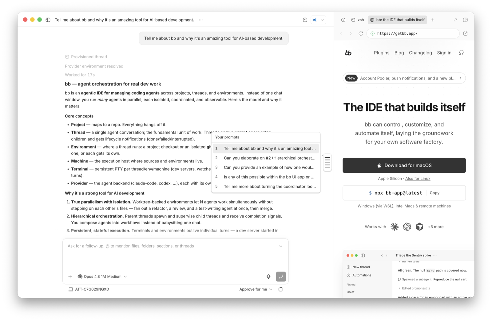

# bb-plugin-threadline

A prompt navigator for long threads. Threadline puts a slim rail on the right
edge of a conversation, one marker per prompt you sent. Hover the rail to preview
any prompt. Click a marker or a preview to jump to that prompt and flash it. The
current prompt stays highlighted as you scroll.

Inspired by [Conductor](https://conductor.build), where I first saw this feature.



## Files

- `server.ts`: one RPC, `outline`, returning the thread's conversation outline
  from `bb.sdk.threads.conversationOutline` (ordered messages, each with a
  preview).
- `app.tsx`: an app-wide overlay (`app.slots.experimental_appOverlay`) that reads
  the active thread with `useBbContext()`, draws the rail, and scrolls the
  timeline.

## How navigation works

The BB timeline is virtualized, so an off-screen prompt is not in the DOM. Each
row carries `data-timeline-row-id`, which equals the outline item id for user
messages. To reach an off-screen prompt, the overlay estimates a scroll position
from the prompt's ordinal, lets the virtualizer render nearby rows, interpolates
from their measured offsets until the target row mounts, then centers it with a
brief highlight.

The active prompt is whichever user row sits nearest the top of the viewport,
recomputed as you scroll. The rail is anchored to the conversation pane, not the
app window, and re-anchors when the pane resizes (for example when the right
panel opens).

## Configure

One setting, `position`, places the rail: `Top`, `Middle` (default), or `Bottom`
(just above the chat input). The frontend reads it with `useSettings()`, so
changes apply without a reload.

```
bb plugin config threadline
bb plugin config threadline set position Bottom
```

## UI components

Threadline keeps only what it uses: `lib/utils.ts` (the `cn` helper) and
`@radix-ui/react-hover-card` for the popover. React, the radix portal primitives,
and the SDK come from BB at runtime and are never bundled, so they stay in
`devDependencies` for typechecking. `components.json` still points at the BB
registry, so `npx shadcn add @bb/select` can vendor more components on demand.

## Install

```
npm install
bb plugin install .
```

After editing sources, reload (or run `bb plugin dev` to rebuild on save):

```
bb plugin reload threadline
```

## Types and API reference

After `npm install`, the full API is on disk:

```
node_modules/@get-bb/plugin-sdk/bundled-types/bb-plugin-sdk.d.ts      # backend
node_modules/@get-bb/plugin-sdk/bundled-types/bb-plugin-sdk-app.d.ts  # frontend
```

Run `bb plugin types` to sync the SDK pin to the running BB, and `bb plugin build`
before publishing.
